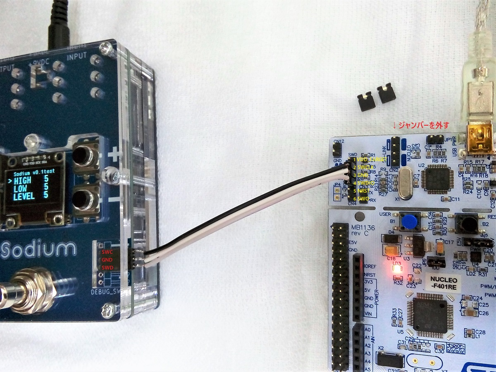

# プログラム書き込み、デバッグ

例として、初期プログラムの書き込み、デバッグまでの手順を説明します。

***

### 1. STM32CubeIDEのインストール
STM32マイコンの統合開発環境として、[STM32CubeIDE](https://www.st.com/ja/development-tools/stm32cubeide.html)をインストールします。ダウンロードに[myST](https://www.st.com/content/st_com/ja.html)への登録が必要です。**このソフトウェアは32bitのOSに対応していません。**初回起動時にWorkspace（作業フォルダ）を設定しますが、パスに全角文字が入らないようにしておきます。STM32CubeIDE未経験の方は、練習としてNucleo Boardを使ったLチカを先にされておくことをお勧めします。

- 参考ページ → [STM32 Nucleo STM32F303K8でLチカ & STM32CubeIDEで開発](https://ameblo.jp/denshi-1996/entry-12806626635.html)

***

### 2. 新規プロジェクト作成
- STM32CubeIDEを起動、File → New → STM32 Project
- Part Number に「F722RC」と入力 → STM32F722RC を選択 → Next（※ [Rev.E 基板](006_Rev.E基板での主な変更点.md)の場合、F722RE）
- Project Name に「Sodium_test」と入力 → Finish
- 自動で開かれる Sodium_test.ioc は閉じる

※ 初回はデータのダウンロード等があるため時間がかかります。

***

### 3. 必要なファイルのダウンロード
下記URLからzipファイルをダウンロード・展開し、出てきた8つのファイルを移動させます。
- [https://github.com/kanengomibako/Sodium/raw/main/Src/test/Sodium_test.zip](https://github.com/kanengomibako/Sodium/raw/main/Src/test/Sodium_test.zip)

	- Sodium_test.ioc → プロジェクトフォルダ内の同名ファイルに上書き
	- main.c → Core/Src フォルダ内の同名ファイルに上書き
	- user_main.c　fonts.c　ssd1306.c → Core/Src フォルダへ
	- user_main.h　fonts.h　ssd1306.h → Core/Inc フォルダへ

ディスプレイ用ライブラリは下記リポジトリのものを利用しています。
- [https://github.com/4ilo/ssd1306-stm32HAL](https://github.com/4ilo/ssd1306-stm32HAL)

***

### 4. コード出力、ビルド
- Sodium_test.ioc を開き、歯車アイコンをクリックしてコード出力

※ バージョンが違うといったメッセージが表示された場合は、「Migrate」を選択します。

- 金槌アイコンをクリックしてビルド開始

***

### 5. デバッガの接続、デバッグ
- デバッガのSWCLK、GND、SWDIOピンを、SodiumのSWC、GND、SWDピンへそれぞれ接続

▼ Nucleo Board（Nucleo-64タイプ）を使う場合（左上のジャンパーを外しておく）
  

- 虫アイコンをクリック → 設定ウィンドウが2種類出てくるが、両方ともそのままOK

プログラムが書き込まれ、デバッグが開始されます。デバッグ画面では動作開始、一時停止等の操作を行うことができます。