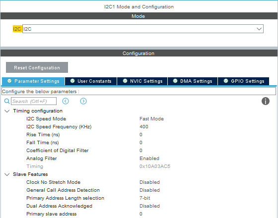
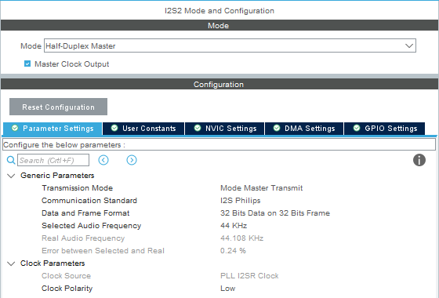
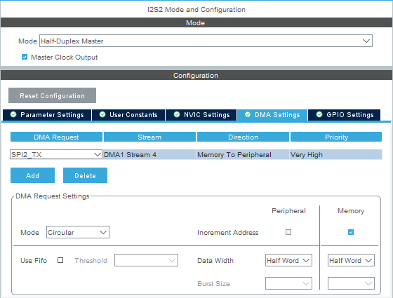
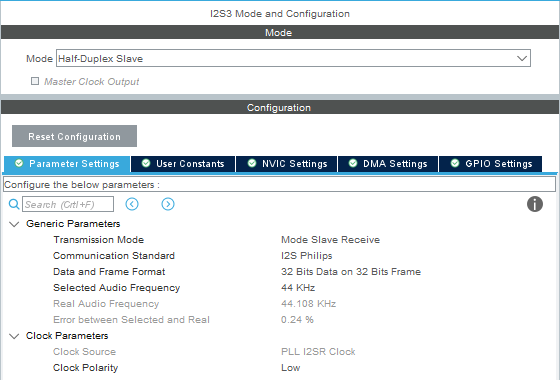
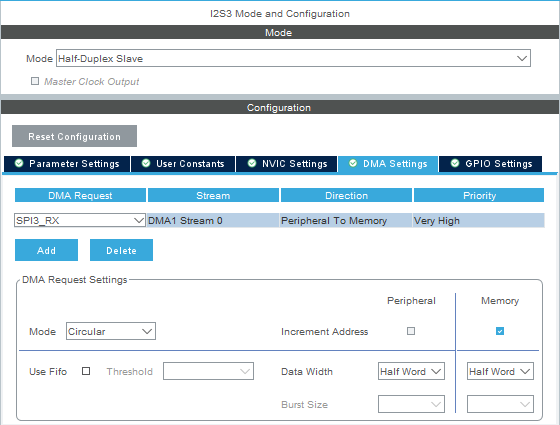
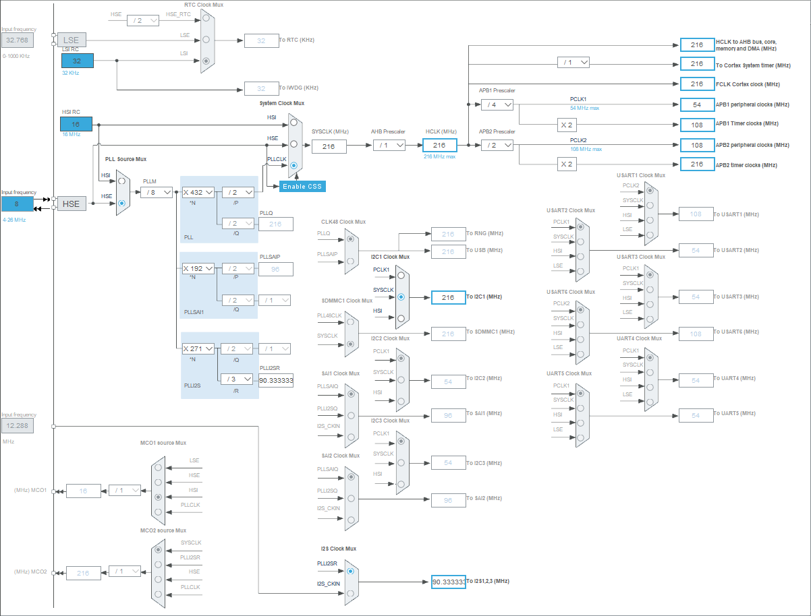
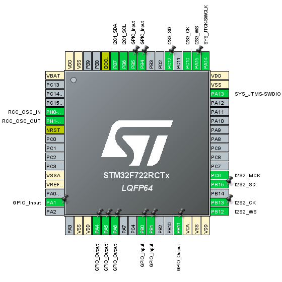
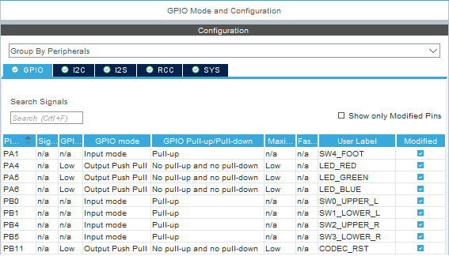

# マイコンの機能設定

iocファイルを開くと、STM32マイコンのピンや機能の設定を行うことができます。Sodiumでの設定内容について説明します。

***

### 1. システム
- 処理高速化のためARTアクセラレータ、Dキャッシュを有効化
	- System Core → CORTEX_M7 → Cortex Interface Settings
		- ART ACCELERATOR : Enabled
		- CPU DCache : Enabled
- クロック源として外部水晶振動子を使用
	- System Core → RCC → High Speed Clock (HSE) [Crystal/Ceramic Resonator]
- デバッガ接続
	- System Core → SYS → Debug [Serial Wire]

***

### 2. OLEDディスプレイ接続（I2C）

- I2C1を有効化
	- Connectivity → I2C1 → I2C [I2C]
	- Parameter Settings タブ → I2C Speed Mode [Fast Mode]
	- PB6、PB7 を使うようにピン設定
	
	 

***

### 3. オーディオコーデック接続（I2S）
- I2S2を有効化
	- Multimedia → I2S2 → MODE → Mode [Half-Duplex Master]　Master Clock Output にチェック
	- Parameter Settings タブ
		- Data and Frame Format [32 Bits Data on 32 Bits Frame]
		- Selected Audio Frequency [44 KHz]
		
		 
		
	- DMA Settings タブ → Addボタンで追加 → DMA Request [SPI2_TX]  Priority [Very High]
		- Mode : Circular
		- Data Width (Peripheral) : Half Word
		- Data Width (Memory) : Half Word
		
		 
		
	- PB12、PB13、PB15、PC6 を使うようにピン設定
- I2S3を有効化
	- Multimedia → I2S3 → MODE → Mode [Half-Duplex Slave]
	- Parameter Settings タブ
		- Transmission Mode [Mode Slave Receive]
		- Data and Frame Format [32 Bits Data on 32 Bits Frame]
		- Selected Audio Frequency [44 KHz]
		
		 
		
	- DMA Settings タブ → Addボタンで追加 → DMA Request [SPI3_RX]  Priority [Very High]
		- Mode : Circular
		- Data Width (Peripheral) : Half Word
		- Data Width (Memory) : Half Word
		
		 
		
	- PA15、PC10、PC12 を使うようにピン設定

***

### 4. クロック
- Clock Configration タブで下図の通り設定

 

実際のオーディオサンプリングレートは、I2Sクロックを2の累乗数で割った数となるため、90.333 MHz ÷ 2048 ＝ 44108.07 Hz です。44.1kHzから少しズレますが、プログラム上の定義をこの値にすれば実用上問題はありません（#define SAMPLING_FREQ 44108.07f）。

オーディオサンプリングレートを48kHzや96kHzにする場合は、PLLI2Sを [×295] [/3] とすると誤差が少ないです（98.333 MHz ÷ 2048 ＝ 48014.32 Hz）。

***

### 5. スイッチ・LED（GPIO）
- Pinout viewで入力ピン（PA1、PB0、PB1、PB4、PB5）、出力ピン（PA4、PA5、PA6、PB11）を設定

 

- System Core → GPIO から入力ピンのプルアップとユーザーラベルを設定

 

ユーザーラベルを入力しておくと、main.h に定義が自動出力されます。（例：#define SW4_FOOT_Pin GPIO_PIN_1）

- ユーザーラベル一覧 
	- PA1	SW4_FOOT
	- PA4	LED_RED
	- PA5	LED_GREEN
	- PA6	LED_BLUE
	- PB0	SW0_UPPER_L
	- PB1	SW1_LOWER_L
	- PB4	SW2_UPPER_R
	- PB5	SW3_LOWER_R
	- PB11	CODEC_RST

