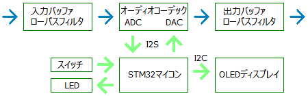
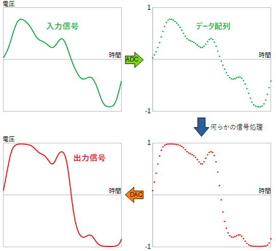
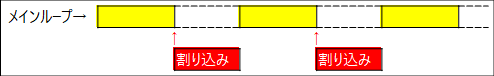
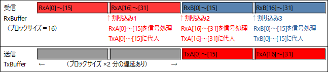

# プログラミング概要

### 1. ハードウェア
Sodiumの回路を簡略化した図を示します。

 

入力信号は、オーディオコーデックでアナログ→デジタル変換され（ADC）、マイコンへ送られます。マイコンで信号処理し送られたデータは、デジタル→アナログ変換され（DAC）出力されます。このデータ送受信の方式は I2S（Inter-IC Sound）フォーマットと呼ばれるものとなっています。

 

機器に入力された音声信号は時間と電圧の関係として表されます。これを一定時間ごとにサンプリング（電圧読み取り）し、データ配列としてコンピュータに取り込みます。このサンプルデータに何らかの処理を施すことで、エフェクトをかけるということになります。

オーディオサンプリングレート44.1kHzの場合は、1秒間に44100個※のデータサンプルを送受信します。効率よく処理するため、ある程度まとまったサンプル数で処理を行います。このサンプルの個数がブロックサイズです。（※ 正確には、LchとRchで1組として44100組、88200個）

マイコンからディスプレイへのデータ送信はI2C（Inter-Integrated Circuit）と呼ばれる通信方式です。

***

### 2. 動作の流れ

- メインループ
	
	まず main.c の main 関数が実行されますが、その中で各機能の初期化後、mainLoop 関数が繰り返し実行されます。Sodiumでは、ここで主にディスプレイ表示の更新を行っています。
	※ main.c に直接主なコードを書いてもよいのですが、誤って USER CODE 以外の部分に書いてしまうとコード自動生成時に消去されるので、user_main.cpp という別ファイルに分けています。
	
- I2S 割り込み
	
	I2S通信で常にデータの入出力を行っていますが、ブロックサイズごとに割り込みが起こるようになっています（3. 信号処理詳細 参照）。この割り込み時にエフェクト処理やスイッチ状態の読み取りを行っています。

 

デュアルコアではないので、同時並行して処理を進めることはできません。基本は信号処理（割り込み）を行い、空いた時間にメインループの処理が進みます。もし信号処理に時間がかかりすぎれば、メインループ側の処理が進まないのでディスプレイ表示の更新がうまくいかないことになります。

***

### 3. 信号処理詳細

I2S用の送受信バッファ配列サイズはブロックサイズの4倍となっています。中身は「Lch前半・後半、Rch前半・後半」で、データの順序はLR交互（L・R・L・R...）ですが、ここではLRで1組として考えます。

データ前半の受信が終わると user_main.cpp にある HAL_I2S_RxHalfCpltCallback 関数が、後半の受信が終わると HAL_I2S_RxCpltCallback 関数が呼び出されます。下図のような流れです。

 

例えば音量を上げるエフェクトの場合は、この割り込み内でデータ数値を増加させればいいということになります。

割り込みの間隔は、ブロックサイズ16、サンプリングレート44.1kHzの場合 16 / 44.1 = 0.36 ms（ミリ秒）です。処理遅延はこの2倍発生し、さらにオーディオコーデックIC自体の遅延があるため、全体の遅延（レイテンシ）は約1.5msとなっています。

- DMAについて

  DMA（Direct Memory Access）はデータ送受信の繰り返しを自動で行ってくれる便利な機能です。ただし転送は16ビット単位で、32ビットの場合上位と下位16ビットが入れ替わってしまうため、swap16 という関数を入れる処理を行っています。

***

### 4. スイッチ

前述の通り、I2S 割り込みは定期的に起こります。スイッチが押されているかどうかの読み取り（HAL_GPIO_ReadPin 関数）も割り込み内で行います。

読み取りはそこまで頻繁に行う必要はないため、割り込み1では左上スイッチ、割り込み2では左下スイッチ...というように読み取るスイッチを順番に入れ替えています。（フットスイッチはタップテンポの精度に関係してくるため、毎回読み取りを行っています。）

スイッチのチャタリングによる誤検出防止のため、数回連続で押されている判定があった場合に処理を行います。判定時間は #define SHORT_PUSH_MSEC 20 といった具合に設定しています。

***

### 5. データ保存

データ保存については下記ブログ記事にまとめています。

- [STM32 内蔵フラッシュメモリへのデータ保存](https://drugscore.blog.fc2.com/blog-entry-250.html)

STM32F722RCT6の場合、データ保存先はセクタ5（開始アドレス 0x08020000）です。データ保存容量はもっと少なくてよいのですが、現状プログラムの容量が大きくないためそのままにしています。

フラッシュメモリは1万回以上書き換えできますが、プログラミングのミスで繰り返し書き込みが発生するような状態が起きると寿命が縮まってしまうため、注意が必要です。

***

### 6. 最適化設定

STM32CubeIDEで、コンパイラの最適化設定を高速動作向けに変更できます。
- Project → Properties → C/C++ Build → Settings → Tool Settings タブ
	- C言語
		- MCU GCC Compiler → Optimization → Optimization level [Optimize Most (-O3)]
	- C++
		- MCU G++ Compiler → Optimization → Optimization level [Optimize Most (-O3)]