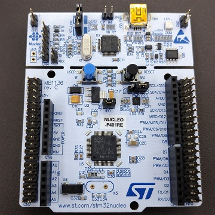
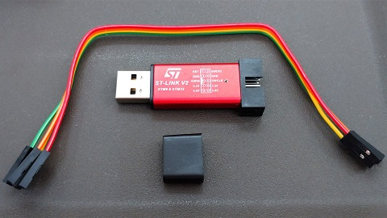

# デバッガ購入について

### STマイクロ純正デバッガ

- [Nucleo Board](https://jp.rs-online.com/web/p/microcontroller-development-tools/8644009)、[Discovery Kit](https://jp.rs-online.com/web/p/microcontroller-development-tools/7587554)

   

  低価格なマイコンボードです。デバッガが上部についており、切り込み部分から切り離して使うこともできます。ケースがなくむき出しの状態なので、取り回しに注意が必要です。どの種類を買えばいいかわからない場合は、スペックが高い[STM32F446RE](https://jp.rs-online.com/web/p/microcontroller-development-tools/9064624)で問題ないでしょう。※コネクタ付コード、USBケーブルが別途必要です。

- [ST-LINK/V2](https://jp.rs-online.com/web/p/chip-programmers/7141701)、[STLINK-V3SET](https://akizukidenshi.com/catalog/g/gM-14361/)

  Nucleo Boardより高価なので購入していません。ST純正で安心・高機能で、ケースに入っているため取り回しもしやすいと思われます。

---

### ST-LINK V2 互換品

 

AmazonやAliExpressで販売されている、低価格でコンパクトなST-LINK互換品です。~~十数個買ってみましたが特に問題なく使えたので、とにかく安く済ませたい場合はこちらで大丈夫だと思います。~~**最新のSTM32CubeIDE（1.13.2）ではファームウェアのアップグレードができず、使えなくなりました。**