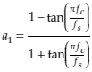

# 1次ローパス・ハイパスフィルタ

アナログ回路において抵抗器1個とコンデンサ1個で構成されるような1次フィルタについて、デジタルでの実装を説明します。※ デジタルフィルタの原理を理解するのは難しいため、結果のみ利用することにします。

---

1次フィルタは次の式で表されます（a<sub>1</sub> の符号はマイナスで記載されていることがあります）。

- y<sub>n</sub> = b<sub>0</sub> x<sub>n</sub> + b<sub>1</sub> x<sub>n-1</sub> + a<sub>1</sub> y<sub>n-1</sub>　【 x<sub>n</sub>：入力データ　y<sub>n</sub>：出力データ　b<sub>0</sub> 、b<sub>1</sub> 、a<sub>1</sub> ：定数】

x<sub>n-1</sub> や y<sub>n-1</sub> は、1つ前の入出力データです（遅延させたものといわれる場合もあります）。前回のデータを保存しておき、次回計算の時に使用します。

カットオフ周波数 fc により定数が変わり、次の式となります。

-  【 fs：サンプリング周波数】

- 1次ローパスフィルタ（LPF）

  b<sub>0</sub> = b<sub>1</sub> = (1 - a<sub>1</sub>) / 2

- 1次ハイパスフィルタ（HPF）

  b<sub>0</sub> = - b<sub>1</sub> = (1 + a<sub>1</sub>) / 2

【参考ページ】
- [The Scientist and Engineer's Guide to Digital Signal Processing](http://www.dspguide.com/) - [Chapter 19: Recursive Filters](https://www.dspguide.com/ch19/1.htm)
- [IIR filter design equations for Sound Terminal® devices](https://www.st.com/resource/ja/application_note/dm00038862.pdf) (pdf)

---

[lib_filter.hpp](https://github.com/kanengomibako/Sodium/blob/main/Src/example/lib_filter.hpp) のコード内容について説明します。

- 定数 a<sub>1</sub> の計算

```c++
/* 2 * PI * fc / fs 計算 -----------------------------*/
inline float omega(float fc)
{
  return 2.0f * PI * fc / SAMPLING_FREQ;
}

/* 1次LPF、HPF、APF用の係数計算 tanを近似 誤差10kHz:-1% 14kHz:-2% 17kHz:-3% -------*/
inline float lpfCoef(float fc)
{
  // 近似でない計算式(不使用)
  //float w = PI * fc / SAMPLING_FREQ; // 2 * PI * fc / fs の2分の1を計算
  //return (1 - tanf(w)) / (1 + tanf(w));

  float w = 0.25f * PI * fc / SAMPLING_FREQ; // 2 * PI * fc / fs の8分の1を計算
  float w2 = w * w;
  float w3 = w2 * w;
  float w4 = w2 * w2;
  return (w4 + 4.0f * w3 - 6.0f * w2 - 4.0f * w + 1.0f) /
         (w4 - 4.0f * w3 - 6.0f * w2 + 4.0f * w + 1.0f);
}
```
高速化のため、近似式を使用しています（2倍角の公式を2回使い、tan ω = ω で近似して計算）。高い周波数だとズレがやや大きくなりますが、実用上問題はありません。<br>
<br>

- LPF
```c++
  void set(float fc)
  {
    a1 = lpfCoef(fc);
    b0 = 0.5f * (1.0f - a1);
  }

  float process(float x)
  {
    float y = b0 * x + b0 * x1 + a1 * y1; // b1 = b0
    x1 = x;
    y1 = y;
    return y;
  }
```
- HPF
```c++
  void set(float fc)
  {
    a1 = lpfCoef(fc);
    b0 = 0.5f * (1.0f + a1);
  }

  float process(float x)
  {
    float y = b0 * x - b0 * x1 + a1 * y1; // b1 = -b0
    x1 = x;
    y1 = y;
    return y;
  }
```
`set`関数でカットオフ周波数を設定し、`process`関数でフィルタを実行します。x1、y1に計算結果を保存しておき、次回呼び出し時にそれを利用して計算します。<br>

---

[fx_filter.hpp](https://github.com/kanengomibako/Sodium/blob/main/Src/example/fx_filter.hpp) は、音量調整とLPF・HPFをかけるエフェクトです。コード内容について説明します。

```c++
private:
  const string name = "FILTER";
  const uint16_t color = COLOR_G; // 緑
  const string paramName[20] = {"LV", "LPF", "HPF"};
  enum paramName {LEVEL, LPF, HPF};
  float param[20] = {1, 1, 1};
  const int16_t paramMax[20] = { 20, 99,100};
  const int16_t paramMin[20] = {-20,  1,  1};
  const uint8_t paramNumMax = 3;

  signalSw bypass;
  lpf lpf1;
  hpf hpf1;
```
パラメータ設定はフィルタのカットオフ周波数とゲインです。下部でフィルタのインスタンス生成を行っています。<br>
<br>

```c++
  virtual void setParam()
  {
    static uint8_t count = 0;
    count = (count + 1) % 10; // 負荷軽減のためパラメータ計算を分散させる
    switch(count)
    {
      case 0:
        param[LEVEL] = dbToGain(fxParam[LEVEL]); // LEVEL -20...+20 dB
        break;
      case 1:
        param[LPF] = (float)fxParam[LPF] * 100.0f; // 1次LPF カットオフ周波数 100...9900 Hz
        lpf1.set(param[LPF]);
        break;
      case 2:
        param[HPF] = (float)fxParam[HPF] * 10.0f; // 1次HPF カットオフ周波数 10...1000 Hz
        hpf1.set(param[HPF]);
        break;
      default:
        break;
    }
  }
```
`set`関数でカットオフ周波数設定を更新します。<br>
<br>

```c++
  virtual void process(float xL[], float xR[])
  {
    setParam();

    for (uint16_t i = 0; i < BLOCK_SIZE; i++)
    {
      float fxL = xL[i];
      fxL = lpf1.process(fxL); // 1次LPF
      fxL = hpf1.process(fxL); // 1次HPF
      fxL = param[LEVEL] * fxL; // LEVEL
      xL[i] = bypass.process(xL[i], fxL, fxOn);
    }
  }
```
エフェクト用データ`fxL`に対し、順に`process`関数を実行します。

[lib_filter.hpp](https://github.com/kanengomibako/Sodium/blob/main/Src/example/lib_filter.hpp) には`lpf2nd`と`hpf2nd`という2次フィルタのクラスも準備しています。これは単純に1次フィルタを2回かけたもので、使い方は1次フィルタと同じです。