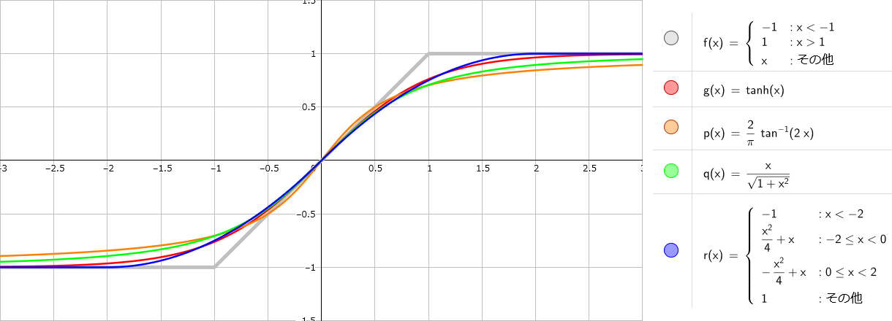

# クリッピング・オーバードライブ

歪み系エフェクトに使うクリッピングについて、下記記事にまとめています。

- [歪みと波形・倍音その9（非線形性と歪み）](https://kanengomibako.github.io/pages/00209.html)

クリッピングに使いやすそうな関数を下図にまとめました。歪み始めや頭打ち部分の音量がそれぞれ違ってくるため、似たような形になるように適宜調整しています。（[GeoGebra](https://www.geogebra.org/) で作成）



下記参考ページでは、tanh 関数を変形させた例が記載されています。

- [gDSP](http://gdsp.hf.ntnu.no/) - [The modified tanh() function](http://gdsp.hf.ntnu.no/lessons/3/18/)

---

[fx_overdrive.hpp](https://github.com/kanengomibako/Sodium/blob/main/Src/example/fx_overdrive.hpp) （オーバードライブ）のコード内容について説明します。

```c++
private:
  const string name = "OVERDRIVE";
  const uint16_t color = COLOR_RG; // 赤緑
  const string paramName[20] = {"LEVEL", "GAIN", "TREBLE", "BASS"};
  enum paramName {LEVEL, GAIN, TREBLE, BASS};
  float param[20] = {1, 1, 1, 1};
  const int16_t paramMax[20] = {100,100,100,100};
  const int16_t paramMin[20] = {  0,  0,  0,  0};
  const uint8_t paramNumMax = 4;

  signalSw bypass;
  hpf hpfFixed, hpfBass; // 出力ローカット、入力BASS調整
  lpf lpfFixed, lpfTreble; // 入力ハイカット、出力TREBLE調整
```
コントロールは全て0～100としました。下部で固定値のフィルタとトーン調整用フィルタを準備しています。<br>
<br>

```c++
  virtual void setParam()
  {
    static uint8_t count = 0;
    count = (count + 1) % 10; // 負荷軽減のためパラメータ計算を分散させる
    switch(count)
    {
      case 0:
        param[LEVEL] = logPot(fxParam[LEVEL], -50.0f, 0.0f);  // LEVEL -50～0 dB
        break;
      case 1:
        param[GAIN] = logPot(fxParam[GAIN], 20.0f, 60.0f); // GAIN 20～60 dB
        break;
      case 2:
        param[TREBLE] = 10000.0f * logPot(fxParam[TREBLE], -30.0f, 0.0f); // TREBLE LPF 320～10k Hz
        break;
      case 3:
        param[BASS] = 2000.0f * logPot(fxParam[BASS], 0.0f, -20.0f); // BASS HPF 200～2000 Hz
        break;
      case 4:
        lpfTreble.set(param[TREBLE]);
        break;
      case 5:
        hpfBass.set(param[BASS]);
        break;
      case 6:
        lpfFixed.set(4000.0f); // 入力ハイカット 固定値
        break;
      case 7:
        hpfFixed.set(30.0f); // 出力ローカット 固定値
        break;
      default:
        break;
    }
  }
```
`logPot`関数は [lib_calc.hpp](https://github.com/kanengomibako/Sodium/blob/main/Src/example/lib_calc.hpp) にある通り、パラメータ整数値 0 ～ 100 を dB 倍率へ変換します。この関数はゲインだけでなく、フィルタの周波数についても調整しやすいです。上記`BASS`のハイパスフィルタ周波数の場合は 0 dB（1倍）～ -20 dB（0.1倍）で計算され、2000 ～ 200 Hz で変化するという具合です。

固定値のフィルタ周波数設定（`set`）は何度も実行する必要はないため、`init`関数内に記載しても問題ありません。<br>
<br>

```c++
  virtual void process(float xL[], float xR[])
  {
    setParam();

    for (uint16_t i = 0; i < BLOCK_SIZE; i++)
    {
      float fxL = xL[i];

      fxL = hpfBass.process(fxL);   // 入力ローカット BASS
      fxL = lpfFixed.process(fxL);  // 入力ハイカット 固定値
      fxL = param[GAIN] * fxL;      // GAIN
      fxL = atanf(fxL + 0.5f);      // arctanによるクリッピング、非対称化
      fxL = hpfFixed.process(fxL);  // 出力ローカット 固定値 直流カット
      fxL = lpfTreble.process(fxL); // 出力ハイカット TREBLE
      fxL = param[LEVEL] * fxL;     // LEVEL

      xL[i] = bypass.process(xL[i], fxL, fxOn);
    }
  }
```
HPF → LPF → GAIN → クリッピング → HPF → LPF → LEVEL という流れです。クリッピングは直流成分を加えて非対称としましたが、直流成分を増幅しないように、直後にハイパスフィルタを入れます。