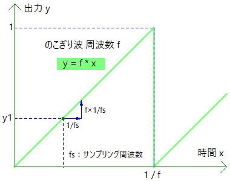

# オシレータ・トレモロ

揺れ系エフェクトに使う LFO（Low Frequency Oscillator）の実装について説明します。下図は周波数 f（周期 1 / f ）、出力 0 ～ 1 ののこぎり波です。

 

直線の傾きは 1 ÷ ( 1 / f ) で f となります。ある時点の出力 y1 から、次のサンプル時点までに経過する時間は 1 / fs です。増加する出力は傾き f × ( 1 / fs ) で f / fs となります。[lib_osc.hpp](https://github.com/kanengomibako/Sodium/blob/main/Src/example/lib_osc.hpp) の`sawWave`クラスでは下記コードです。

```c++
  float output()
  {
    float y = y1 + freq / SAMPLING_FREQ;
    if (y > 1) y = y - 1.0f;
    y1 = y; // 前回出力値を記録
    return y;
  }
```

前回の出力値を記録しておき、 f / fs を足して出力します。出力が 1 を超えた時点で 1 を引いてリセットします（0 にすると周期が少しズレてしまいます）。y1 の初期値を変更しておけば、位相を変えることができます。

正弦波と三角波（`sineWave`、`triangleWave`クラス）はのこぎり波を利用して実装しています。低い周波数だけでなく可聴域の音声信号も出力可能です。[fx_oscillator.hpp](https://github.com/kanengomibako/Sodium/blob/main/Src/example/fx_oscillator.hpp) はエフェクトではなく波形テスト用の発振器です。

---

[fx_tremolo.hpp](https://github.com/kanengomibako/Sodium/blob/main/Src/example/fx_tremolo.hpp) （トレモロ）のコード内容について説明します。

```c++
  virtual void setParam()
  {
    static uint8_t count = 0;
    count = (count + 1) % 10; // 負荷軽減のためパラメータ計算を分散させる
    switch(count)
    {
      case 0:
        param[LEVEL] = logPot(fxParam[LEVEL], -20.0f, 20.0f);  // LEVEL -20～20 dB
        break;
      case 1:
        param[RATE] = 0.01f * (105.0f - (float)fxParam[RATE]); // RATE 周期 1.05～0.05 秒
        break;
      case 2:
        param[DEPTH] = (float)fxParam[DEPTH] * 0.1f; // DEPTH -10～10 dB
        break;
      case 3:
        param[WAVE] = logPot(fxParam[WAVE], 0.0f, 50.0f); // WAVE 三角波～矩形波変形
        break;
      case 4:
        tri.set(1.0f / param[RATE]); // 三角波 周波数設定
        break;
      default:
        break;
    }
  }
```
三角波で音量を最大 ±10 dB 揺らします。WAVE コントロールは、揺れに使う波形を矩形波に変形させます。<br>
<br>

```c++
  virtual void process(float xL[], float xR[])
  {
    setParam();

    for (uint16_t i = 0; i < BLOCK_SIZE; i++)
    {
      float fxL = xL[i];

      float gain = 2.0f * tri.output() - 1.0f; // LFO -1～1 三角波
      gain = param[WAVE] * gain;     // 三角波を増幅
      if (gain > 1.0f) gain = 1.0f;  // クリッピング（矩形波に近い形へ）
      if (gain < -1.0f) gain = -1.0f;
      gain = param[DEPTH] * gain; // DEPTH -10～10 dB

      fxL = dbToGain(gain) * fxL; // 音量を揺らす
      fxL = param[LEVEL] * fxL;   // LEVEL

      xL[i] = bypass.process(xL[i], fxL, fxOn);
    }
  }
```
LFO の出力はわかりやすいように -1 ～ 1 の範囲としました。矩形波の音量変化が大きすぎる場合、「プチッ」というノイズが聞こえる場合があります。クリッピングに tanh 等の関数を用いてみるのもよいかもしれません。