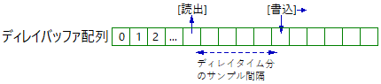

# ディレイ

音を遅延させるディレイは、RAM 等の保存領域に音声信号データを保存しておき、必要に応じてそのデータを取り出すことで実現できます。

---

モノラル、サンプリング周波数 44.1 kHzの場合、1 秒間に 44100 個のデータがあるので、1 秒の遅延にはこの個数分格納できる配列が必要です。データを 32 bit float 型とすると、容量としては 32 × 44100 = 1411200 ビット（単位換算後 176.4 キロバイト）となります。

下図のように、配列にデータ書き込み→配列の添字を1つ増やす（右に移動）を繰り返します。配列の最後まで到達すると配列の先頭に戻って書き込みます。

 

0.5 秒前のデータは、22050 サンプル離れたところにあるため、そこからデータを読み出せば 0.5 秒分遅延した音が取り出せます。一番古いデータは現在書き込む位置の右隣に位置することになります。

※ ディレイバッファ配列は、最後尾と先頭が繋がった円状の配列（リングバッファ）として解説されている場合もあります。


---

[lib_delay.hpp](https://github.com/kanengomibako/Sodium/blob/main/Src/example/lib_delay.hpp) 内のクラス`delayBuf`のコード内容について説明します。

```c++
  void set(float maxDelayTime) // バッファ配列メモリ確保 最大ディレイ時間 ms
  { // ※メモリ確保失敗検知未実装 std::bad_alloc を使う場合は -fexceptions コンパイルオプションが必要
    maxDelaySample = 1 + (uint32_t)(SAMPLING_FREQ * maxDelayTime / 1000.0f); // 最大サンプル数計算
    delayArray = new int16_t[maxDelaySample](); // メモリ確保（0初期化）
  }
```
ディレイバッファ配列用のメモリを動的に確保するため`new`を使います。データ型を`int16_t`にすると保存容量が float の半分で済むため、より長いディレイタイムが可能となります（クラス`delayBufF`が float バージョンです）。何らかの理由でメモリ確保に失敗した場合の処理は現状未実装です。<br>
<br>

```c++
  void erase() // バッファ配列メモリ削除
  {
    delete[] delayArray;
  }
```
`new`で確保したメモリを`delete[]`で開放します。<br>
<br>

```c++
  void write(float x) // バッファ配列書き込み、書込位置を進める
  {
    if (x < -1.00f) x = -1.00f; // オーバーフロー防止
    if (x > 0.999f) x = 0.999f;
    delayArray[wpos] = (int16_t)(x * 32768.0f); // 16ビット整数で書き込み
    wpos++; // 書込位置を1つ進める
    if (wpos == maxDelaySample) wpos = 0; // 最大サンプル数までで0に戻す
  }
```
配列に書き込むと同時に書き込み位置を進める操作も行っています。データ型を`int16_t`にしているため、オーバーフロー防止措置が必要です。<br>
<br>

```c++
  float read(float delayTime) // 通常のサンプル単位での読み出し ディレイ時間 ms
  {
    uint32_t interval = (uint32_t)(0.001f * delayTime * SAMPLING_FREQ); // 書込位置と読出位置の間隔を計算
    if (interval > maxDelaySample) interval = maxDelaySample; // 最大ディレイ時間を超えないようにする
    uint32_t rpos; // read position 読出位置
    if (wpos >= interval) rpos = wpos - interval; // 読出位置を取得
    else rpos = wpos + maxDelaySample - interval;
    return (float)delayArray[rpos] / 32768.0f; // バッファ配列からfloat(-1～1)で読み出し
  }
```
ディレイタイム分のサンプル数（`interval`）を計算し、書き込み位置からその分遡って読み出し位置を割り出します。※ `readLerp`関数については別記事にて説明する予定です。<br>
<br>

---
[fx_delay.hpp](https://github.com/kanengomibako/Sodium/blob/main/Src/example/fx_delay.hpp) のコード内容について説明します。

```c++
private:
  const string name = "DELAY";
  const uint16_t color = COLOR_RB; // 赤青
  const string paramName[20] = {"TIM", "E.LV", "F.BACK", "TONE", "TRAIL", "DIV"};
  enum paramName {DTIME, ELEVEL, FBACK, TONE, TRAIL, TAPDIV};
  float param[20] = {1, 1, 1, 1, 1, 1};
  const int16_t paramMax[20] = {1500,100, 99,100,  1,  5};
  const int16_t paramMin[20] = {  10,  0,  0,  0,  0,  0};
  const uint8_t paramNumMax = 6;

  // 最大ディレイタイム 16bit モノラルで2.5秒程度まで
  const float maxDelayTime = 1500.0f;

  // タップテンポ DIV定数 0←→5で循環させ、実際使うのは1～4
  const string tapDivStr[6]  = {"1/1", "1/1", "1/2", "1/3", "3/4", "1/1"};
  const float tapDivFloat[6] = {1.0f, 1.0f, 0.5f, 0.333333f, 0.75f, 1.0f};

  signalSw bypassIn, bypassOut;
  delayBuf del1;
  lpf2nd lpf2ndTone;
```
ディレイ音を残す`TRAIL`機能、タップテンポ機能を盛り込んでいます。`DIV`はタップテンポで設定した時間を必要に応じて割るためのものです。

バイパスはディレイ音が残らないように入力側と出力側の二つで行います。<br>
<br>

```c++
  virtual void init()
  {
    //（中略）

    del1.set(maxDelayTime); // 最大ディレイタイム分のメモリ確保
  }
```
初期化時（起動時またはエフェクト切り替え時）にメモリ確保を行います。<br>
<br>

```c++
  virtual void deinit()
  {
    del1.erase();
  }
```
終了時（エフェクト切り替え時）にメモリの開放を行います。<br>
<br>

```c++
  virtual void setParam()
  {
    float divTapTime = tapTime * tapDivFloat[fxParam[TAPDIV]]; // DIV計算済タップ時間
    static uint8_t count = 0;
    count = (count + 1) % 10; // 負荷軽減のためパラメータ計算を分散させる
    switch(count)
    {
      case 0:
        if (divTapTime > 10.0f && divTapTime < maxDelayTime) // タップテンポ設定時
        {
          fxParam[DTIME] = (int16_t)divTapTime;
        }
        param[DTIME] = (float)fxParam[DTIME]; // DELAYTIME 10 ～ 1500 ms
        break;
      //（中略）
    }
  }
```
グローバル変数`tapTime`にタップテンポ機能で取得した時間が格納されています（未取得の場合は 0 を格納）。これを実際のディレイタイムに反映させます。<br>
<br>

```c++
  virtual void process(float xL[], float xR[])
  {
    setParam();

    for (uint16_t i = 0; i < BLOCK_SIZE; i++)
    {
      float fxL;

      fxL = del1.read(param[DTIME]); // ディレイ音読込
      fxL = lpf2ndTone.process(fxL); // ディレイ音のTONE（ハイカット）

      // ディレイ音と原音をディレイバッファに書込、原音はエフェクトオン時のみ書込
      del1.write(param[FBACK] * fxL + bypassIn.process(0.0f, xL[i], fxOn));

      fxL = param[ELEVEL] * fxL; // ディレイ音レベル

      xL[i] = xL[i] + bypassOut.process(param[TRAIL] * fxL, fxL, fxOn); // TRAIL ON時ディレイ音残す
    }
  }
```
`fxL`はディレイ音のみ格納しています。ディレイバッファ配列にフィードバックさせたディレイ音を書き込むため、先にディレイ音を読み込んでいます。
