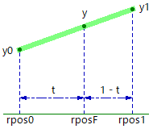

# ビブラート・コーラス

前回の[ディレイ](250_ディレイ.md)に引き続き、ディレイタイムを変化させることを考えます。周期的にディレイタイムを変化させると、音程が揺れてビブラートがかかります。ビブラートをかけた音と原音をミックスすると、コーラスとなります。

ディレイバッファ配列に保存している音声信号データは、1 サンプル時間ごとの飛び飛びの値です。ディレイタイムを滑らかに変化させる場合は、サンプルとサンプルの間の値を使う必要が出てきます。そこで、データ読み出し時に線形補間（Lerp: Linear Interpolate）を行うようにします。

[lib_delay.hpp](https://github.com/kanengomibako/Sodium/blob/main/Src/example/lib_delay.hpp) 内のクラス`delayBufF`の`readLerp`関数は以下の内容です。

```c++
  float readLerp(float delayTime) // 線形補間して読み出し コーラス等に利用
  {
    float intervalF = 0.001f * delayTime * SAMPLING_FREQ; // 書込位置と読出位置の間隔を計算 float
    if (intervalF > (float)maxDelaySample) intervalF = (float)maxDelaySample; // 最大ディレイ時間を超えないようにする
    float rposF; // read position 読出位置 float
    if ((float)wpos >= intervalF) rposF = (float)wpos - intervalF; // 読出位置を取得 float
    else rposF = (float)(wpos + maxDelaySample) - intervalF;
    uint32_t rpos0 = (uint32_t)rposF; // 読出位置の前後の整数値を取得
    uint32_t rpos1 = rpos0 + 1;
    if (rpos1 == maxDelaySample) rpos1 = 0; // 読み出し位置最大と0にまたがる場合
    float t = rposF - (float)rpos0; // 線形補間用係数
    return (1 - t) * delayArray[rpos0] + t * delayArray[rpos1]; // 線形補間値を読み出し
  }
```
下図のようなイメージです。

 

読み出し位置`rposF`を`float`で計算し、前後の整数値`rpos0` `rpos1`を使います。数学的なことについては他のページ（[Wikipedia：線形補間](https://ja.wikipedia.org/wiki/%E7%B7%9A%E5%BD%A2%E8%A3%9C%E9%96%93) 等）をご参照ください。

---
[fx_chorus.hpp](https://github.com/kanengomibako/Sodium/blob/main/Src/example/fx_chorus.hpp) のコード内容について説明します。

```c++
private:
  const string name = "CHORUS";
  const uint16_t color = COLOR_B; // 青
  const string paramName[20] = {"LEVEL", "MIX", "F.BACK", "RATE", "DEPTH", "TONE"};
  enum paramName {LEVEL, MIX, FBACK, RATE, DEPTH, TONE};
  float param[20] = {1, 1, 1, 1, 1, 1};
  const int16_t paramMax[20] = {100,100, 99,100,100,100};
  const int16_t paramMin[20] = {  0,  0,  0,  0,  0,  0};
  const uint8_t paramNumMax = 6;

  signalSw bypass;
  sineWave sin1;
  delayBufF del1;
  hpf hpf1;
  lpf2nd lpf2nd1, lpf2nd2;
```
`MIX`コントロールでビブラート音のみにすることができます。`F.BACK`を上げていくとフランジャーっぽくなります（Resonance や Regeneration というコントロール名の場合があります）。

ディレイタイムを揺らす LFO は正弦波ですが、三角波だと揺れ感が少なくなります。フィルタは二次ローパスフィルタ 2 回分でアナログコーラス風です。<br>
<br>

```c++
  virtual void init()
  {
    //（中略）

    del1.set(20.0f);  // 最大ディレイタイム設定
    hpf1.set(100.0f); // ディレイ音のローカット設定
  }
```
初期化時（起動時またはエフェクト切り替え時）のメモリ確保、ハイパスフィルタ（固定値）の設定を行います。<br>
<br>

```c++
  virtual void deinit()
  {
    del1.erase();
  }
```
終了時（エフェクト切り替え時）にメモリの開放を行います。<br>
<br>

```c++
  virtual void process(float xL[], float xR[])
  {
    setParam();

    for (uint16_t i = 0; i < BLOCK_SIZE; i++)
    {
      float fxL;

      float dtime = 5.0f + param[DEPTH] * (1.0f + sin1.output()); // ディレイタイム 5～15ms
      fxL = del1.readLerp(dtime); // ディレイ音読込(線形補間)
      fxL = lpf2nd1.process(fxL); // ディレイ音のTONE(ハイカット)
      fxL = lpf2nd2.process(fxL);

      // ディレイ音と原音をディレイバッファに書込、原音はローカットして書込
      del1.write(param[FBACK] * fxL + hpf1.process(xL[i]));

      fxL = (1.0f - param[MIX]) * xL[i] + param[MIX] * fxL; // MIX
      fxL = 1.4f * param[LEVEL] * fxL; // LEVEL

      xL[i] = bypass.process(xL[i], fxL, fxOn);
    }
  }
```
正弦波の出力は -1 ～ 1 なので、それを踏まえたディレイタイム設定とします。ディレイタイムの最小値`5.0f`を少なくすると、よりフランジャー向けになります。
