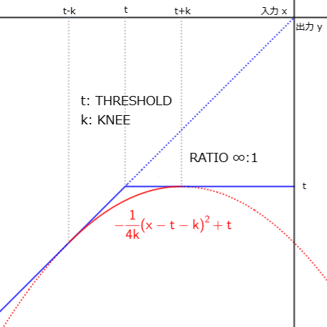

# コンプレッサー

コンプレッサーは、ギター／ベースの音量が一定値以上になったことを検知して音量を下げる（＝圧縮する）エフェクトです。[オートワウ](260_オートワウ.md)の時と同様に、絶対値とローパスフィルタ（LPF）でエンベロープ値を取得し利用することにします。

圧縮開始の速さがアタック、圧縮を元に戻す速さがリリースというパラメータです。アタック・リリースの調整にも LPF を使うことにしました。この LPF のカットオフ周波数を低くすると、高い周波数が削られる＝値の変化が緩やかになるため、反応を遅くすることができます。

---
[fx_compressor.hpp](https://github.com/kanengomibako/Sodium/blob/main/Src/example/fx_compressor.hpp) のコード内容について説明します。

```c++
private:
  const string name = "COMPRESSOR";
  const uint16_t color = COLOR_RGB; // 白
  const string paramName[20] = {"LEVEL", "THRE", "RATIO", "ATK", "REL", "KNEE"};
  enum paramName {LEVEL, THRESHOLD, RATIO, ATTACK, RELEASE, KNEE};
  float param[20] = {1, 1, 1, 1, 1, 1};
  const int16_t paramMax[20] = {100,  0, 11,100,400, 20};
  const int16_t paramMin[20] = {  0,-90,  2,  4,  5,  0};
  const uint8_t paramNumMax = 6;

  signalSw bypass;
  lpf lpfEnv;    // エンベロープ用ローパスフィルタ
  lpf lpfAtkRel; // アタック・リリース用ローパスフィルタ
```
一般的なパラメータに加えて、効き方を滑らかにする`KNEE`というコントロールがあります（別途最下部で説明）。<br>
<br>

```c++
  virtual void init()
  {
    //（中略）

    lpfEnv.set(500.0f); // エンベロープ用ローパスフィルタ設定
    lpfAtkRel.set(100.0f);
  }
```
アタック・リリースの反応を速くするため、エンベロープ用 LPF はほとんどかけていないくらいのカットオフ周波数となっています。<br>
<br>

```c++
  virtual void setParam()
  {
    //（中略）
    
      case 3:
        param[ATTACK] = 100.0f / (float)fxParam[ATTACK]; // ATTACK 4～100ms(LPF周波数1～25Hz)
        break;
      case 4:
        param[RELEASE] = 400.0f / (float)fxParam[RELEASE]; // RELEASE 5～400ms(LPF周波数1～80Hz)
        break;
      case 5:
        param[KNEE] = (float)fxParam[KNEE]; // KNEE 0～20dB
        break;
      default:
        break;
    }
  }
```
アタック・リリース時間（ミリ秒）はあくまで目安で、厳密な時間設定ではありません。実測して確認すると、アタック・リリース用 LPF のカットオフ周波数と反応の速さは概ね反比例の関係になっているようです。

アタック・リリース時間を短く設定していると、周波数の低い音はどうしても波形のゆがみが大きくなってしまいます。ベースでは特に注意しながら調整する必要がありそうです。<br><br>

```c++
  virtual void process(float xL[], float xR[])
  {
    setParam();

    for (uint16_t i = 0; i < BLOCK_SIZE; i++)
    {
      float fxL = xL[i];
      float th = param[THRESHOLD]; // スレッショルド 一時変数
      float dbGain = 0.0f; // コンプレッション(音量圧縮)幅 dB

      float env = abs(fxL);      // エンベロープ
      env = lpfEnv.process(env); // 絶対値とLPFでエンベロープ取得
      env = gainToDb(env);       // dB換算

      if (env < th - param[KNEE])
      {
        dbGain = 0.0f;
        lpfAtkRel.set(param[RELEASE]);      // リリース用LPF周波数を設定
        dbGain = lpfAtkRel.process(dbGain); // リリース用LPFで音量変化を遅らせる
      }
      else
      {
        if (env < th + param[KNEE]) // THRESHOLD ± KNEE の範囲では2次関数の曲線を使用
        {
          th = -0.25f / param[KNEE] * (env - th - param[KNEE]) * (env - th - param[KNEE]) + th;
        }
        dbGain = (env - th) * param[RATIO] + th - env; // 音量圧縮幅計算
        lpfAtkRel.set(param[ATTACK]);       // アタック用LPF周波数を設定
        dbGain = lpfAtkRel.process(dbGain); // アタック用LPFで音量変化を遅らせる
      }

      fxL = dbToGain(dbGain) * fxL; // コンプレッション実行
      fxL = param[LEVEL] * fxL;     // LEVEL

      xL[i] = bypass.process(xL[i], fxL, fxOn);
    }

  }
```
`RATIO`= ∞ での入力 x と出力 y の関係をグラフにすると下図になります。

 

通常は入力が`THRESHOLD`以上で圧縮をかけますが、`KNEE`により`THRESHOLD`付近の圧縮動作を滑らかにします。`THRESHOLD`±`KNEE`の範囲では、2次関数の式を使って`THRESHOLD`を再定義しています。

音量圧縮幅`dbGain`は、出力音から入力音を引いて算出しています。

（例）入力 -20 dB、`THRESHOLD` -30 dB、`RATIO` 5 のとき  
　　出力音：{ (-20) - (-30) } / 5 + (- 30) = -28  
　　出力音 - 入力音：-28 - (-20) = -8 （入力音を -8 dB 変化させる）