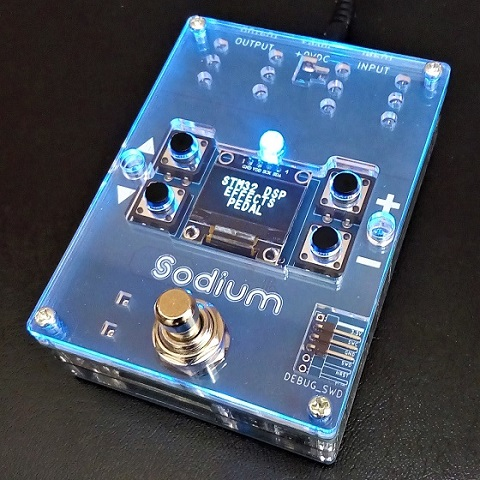

# Sodium
### STM32 Programmable Digital Effects Pedal
STM32マイコンを搭載した、プログラミング可能なデジタルエフェクターです。C言語またはC++で開発を行います。もちろんプログラム書き込み後は単体のエフェクターとして動作可能です。

### 別途必要なもの
- DC9V（センターマイナス）出力のACアダプターで、0.3A以上の電流出力が可能なもの
- PC（Windows、macOS、Linux いずれも可、64bit推奨） ※ 32bit環境では使用できる開発ソフトが限られます。
- STM32対応のデバッガ（プログラム書き込みやデバッグを行う機器） 
	→ [デバッガ購入について](Docs/005_デバッガ購入について.md)
- PCとデバッガを接続するUSBケーブル
- デバッガとSodium本体を接続するケーブル 
	→ [コネクタ付コード 3P](https://akizukidenshi.com/catalog/g/gC-15384/) 等

### 各部の機能
- INPUT 端子：ギターや他の機器からの出力を接続します。
- OUTPUT 端子：アンプや他の機器の入力へ接続します。
- +9VDC 端子：ACアダプターを接続します。
- 各スイッチ：任意の機能をプログラミング可能です。初期プログラムの操作については[別ページ](Docs/000_初期プログラムについて.md)をご参照ください。
- Serial Wire Debug (SWD)接続ピン：デバッガのSWCLK、GND、SWDIOピンを、SodiumのSWC、GND、SWDピンへそれぞれ接続します。

### 資料
- [Rev.E 基板（2021年5月以降販売分）での主な変更点](Docs/006_Rev.E基板での主な変更点.md)
- [初期プログラムについて](Docs/000_初期プログラムについて.md)
- [デバッガ購入について](Docs/005_デバッガ購入について.md)
- [プログラム書き込み・デバッグ](Docs/001_プログラム書き込み・デバッグ.md)
- [サンプルプログラムについて](Docs/002_サンプルプログラムについて.md)
- [マイコンの機能設定](Docs/003_マイコンの機能設定.md)
- [プログラミング概要](Docs/004_プログラミング概要.md)
- [エフェクト種類管理（fx.cpp）について](Docs/100_エフェクト種類管理（fx.cpp）について.md)
- [エフェクトファイル（fx_○○.hpp）について](Docs/110_エフェクトファイル（fx_○○.hpp）について.md)
- [各エフェクト説明目次](Docs/200_各エフェクト説明目次.md)

| 主な仕様 |  |
| - | - |
| サンプリング周波数 | 44.1 kHz（48 kHz または 96 kHz に設定可能） |
| 内部演算 | 32ビット浮動小数点 |
| AD、DA変換 | 24 ビット |
| レイテンシ | 1.5 ミリ秒（初期プログラム実行時） |
| 最大入力レベル | 1.0 Vrms (+2.2 dBu) |
| 入力インピーダンス | 1 MΩ |
| 最大出力レベル | 1.35 Vrms (+4.8 dBu) |
| 出力インピーダンス | 1 kΩ |
| バイパス | バッファード・バイパス（バイパス音もAD/DA変換されます） |
| コントロール | 押しボタンスイッチ×4　フットスイッチ×1 |
| ディスプレイ | 有機ELディスプレイ　モノクロ128×64ドット |
| インジケーター | 3色LED（直径5mm） |
| 接続端子 | INPUT端子　OUTPUT端子　電源入力端子 Serial Wire Debug (SWD)接続ピン |
| 消費電流 | 150 mA |
| 外形寸法 | 幅 73 mm × 奥行 107 mm × 高さ 46 mm （フットスイッチ部を除いた高さ 33 mm） ※ 2021年1月販売分は高さ+2mm |
| 質量 | 240 g |

